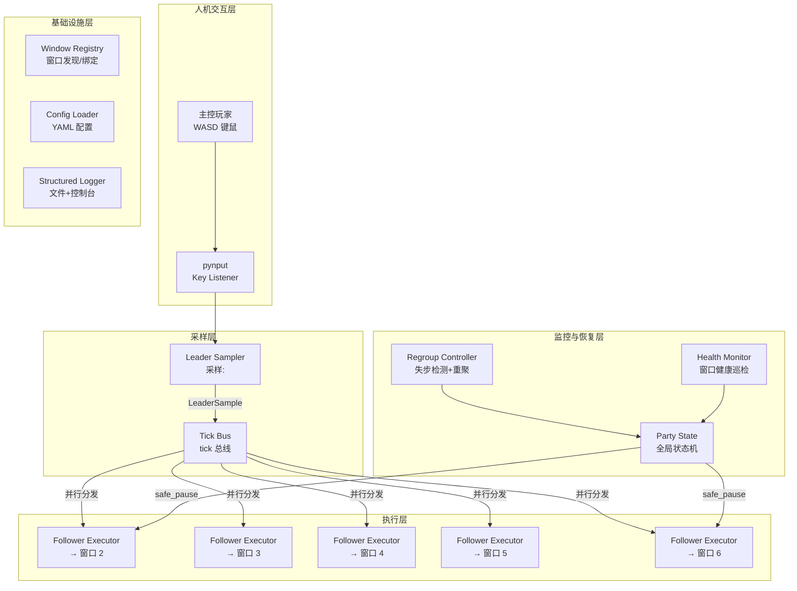
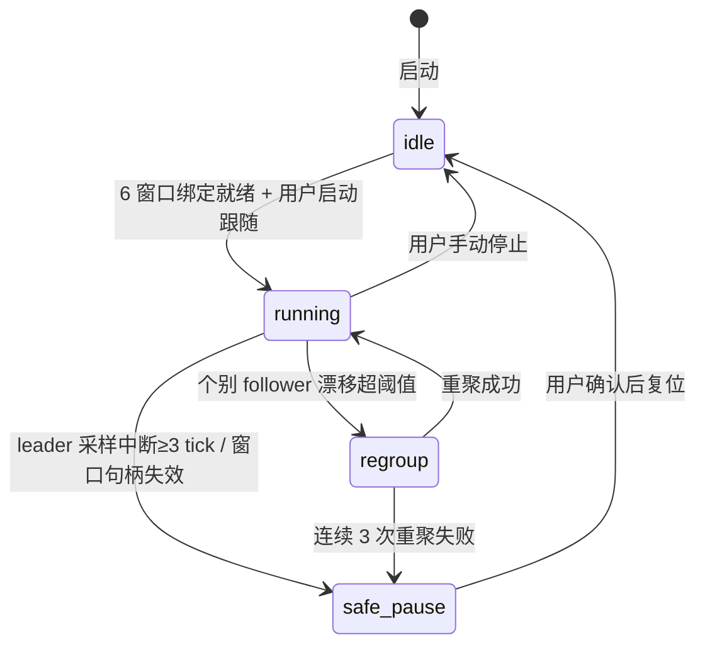

# PoE2 单机六角色自动跟随 技术方案概要

> 详细设计见 [poe2-six-follow-detail-2026-07-13.md](./poe2-six-follow-detail-2026-07-13.md)

## 变更记录

| 日期 | 版本 | 变更内容 | 作者 |
|------|------|---------|------|
| 2026-07-13 | v1.0 | 初版，基于 OpenSpec 契约与已实现代码 | - |

---

## 背景与目标

- **背景**：流放之路2（PoE2）支持在同一台机器上启动多个客户端窗口。玩家希望 1 人主控 1 个角色，其余 5 个角色自动跟随主控移动，以达成单人多角色组队刷图的目的。当前仓库无任何自动化脚本实现。
- **目标**：构建一套 CLI 驱动的 Python 自动化系统，在单机环境下将 1 个主控窗口的键盘移动输入实时复制到 5 个跟随窗口，并具备异常检测、自动恢复和安全降级能力。
- **范围**：
  - 覆盖：窗口绑定管理、主控输入采样、跟随指令分发、失步重聚、安全暂停
  - 不覆盖：战斗技能释放、自动拾取、交易交互、地图/场景识别、跨机器分布式控制

---

## 整体架构

[→ 详细模块设计](./poe2-six-follow-detail-2026-07-13.md#模块设计)

---

## 关键决策

| 决策点 | 选择方案 | 原因 | 放弃方案 |
|--------|---------|------|---------|
| 输入采样方式 | pynput 全局键盘 hook | 不依赖窗口焦点，可在操作 leader 的同时采样 | 窗口内 hook（需焦点） / 内存读取 |
| 跟随驱动模型 | LeaderSample → TickBus → FollowerCommand 单向数据流 | 所有 follower 共享唯一时间线，避免 5 条分叉 | 各自独立采样（时间线分裂） |
| 异常降级策略 | 三级递进：warn → regroup → safe_pause | 先尝试自动恢复，恢复失败才强制暂停；避免过早放弃 | 直接 safe_pause（过度保守） |
| follower 指令分发 | asyncio.gather(return_exceptions=True) | 一个 follower 异常不影响其他；可拓展到 5+ 并发 | 同步串行（延迟累积） |
| 窗口管理 | Win32 API (pywin32) + macOS stub | 支持开发/调试，非 Windows 环境不崩溃 | 纯 Win32（跨平台不可用） |
| 配置格式 | YAML 文件 | 人类可读，支持多套队伍配置 | JSON（噪声大）/ INI（无层级） |

[→ 详细实现](./poe2-six-follow-detail-2026-07-13.md#关键节点)

---

## 内部契约总览

| 模块间数据 | 流向 | 核心字段 | 说明 |
|-----------|------|---------|------|
| `LeaderSample` | LeaderSampler → TickBus | `tickId, movementVector{x,y}, isMoving, heading, event` | 每个 tick 的主控状态快照 |
| `FollowerCommand` | TickBus → FollowerExecutor | `tickId, roleId, action, movementVector, holdMs, reason` | 各 follower 的执行指令 |
| `WindowBinding` | WindowRegistry → PartyState | `roleId, roleType, handle, resolution, status` | 窗口绑定关系 |
| `PartyRuntimeState` | PartyState → all modules | `mode, leaderRoleId, activeFollowers, pausedFollowers, lastError` | 全局运行态 |

[→ 接口对接详情](./poe2-six-follow-detail-2026-07-13.md#接口对接)

---

## 设计评审要点

### 核心交互路径

1. 启动：`python -m src.app config/party-six-follow.yaml` → 加载配置 → 扫描窗口 → 绑定 6 个 POE2 客户端 → 启动 tick 循环
2. 正常运行：主控按 WASD → LeaderSampler 采样 → TickBus 分发 → FollowerExecutors 注入按键到 5 个窗口
3. 失步恢复：RegroupController 检测漂移 → 标记失步 follower → 尝试 regroup（重发移动序列，最多 3 次） → 成功则恢复 / 失败则 safe_pause
4. 异常降级：采样中断 ≥3 tick / regroup 连续失败 → safe_pause → 停止所有自动输入 → 等待人工处理

### 全局状态流转

### 前后端职责边界

本系统为纯本地自动化脚本，无传统前后端。以下是各模块职责边界：

| 行为 | 由谁控制 | 依据 | 说明 |
|------|---------|------|------|
| 移动向量计算 | LeaderSampler | WASD 按键状态 + 组合映射 | 归一化后对齐 8 方向 |
| 事件分类 (move/stop/turn) | LeaderSampler | 当前帧 vs 上一帧向量差 + 角度阈值 | turn 阈值由配置 `sampling.turnThreshold` 决定 |
| 跟随延迟判断 | RegroupController | 配置 `maxFollowerLagMs` + 实际 tick 差 | 超时即标记失步 |
| 全局模式决策 | PartyState | 各模块上报状态 → 状态机转换规则 | 是唯一的真值来源 |

[→ 详细交互设计](./poe2-six-follow-detail-2026-07-13.md#交互设计)

---

## 测试要点

- **核心路径（P0）**：
  - 6 窗口绑定 → 启动跟随 → 主控移动 → 5 follower 同步移动 → 停止 → 无异常退出
  - 配置加载成功校验（follower 数量 = 5，role_id 无重复）
  - 状态机 idle→running→idle 完整流程
- **关键边界**：
  - tick 漏采 ≥2 帧（warn）和 ≥3 帧（safe_pause）
  - follower 漂移 10 tick 后触发 regroup
  - regroup 3 次失败后升级 safe_pause
  - 快速连续按键（短促点按）下的采样完整性
- **回归范围**：当前为新建项目，无回归负担。新增模块后，配置加载和状态机作为基础依赖，后续任何改动都需回归这两项
- **依赖 Mock**：非 Windows 环境下的 window_registry 使用 stub 实现，测试时需将健康检查结果 mock 为 `ready`

[→ 详细测试点](./poe2-six-follow-detail-2026-07-13.md#测试设计)

---

## 风险与待确认

| 类型 | 描述 | 影响 | 应对/截止 |
|------|------|------|---------|
| 技术风险 | Windows 下 pynput 键盘注入到非焦点窗口的可靠性未验证 | 可能导致 follower 窗口收不到按键 | 待 Windows 环境实测；备选方案 SendInput/PostMessage API |
| 技术风险 | 6 个 PoE2 窗口同时运行造成 CPU/GPU 竞争，影响采样 tick 稳定性 | tick 抖动加大，漂移误判率上升 | 建议限制各窗口帧率；加大 `maxDriftTicks` 冗余 |
| 兼容风险 | 不同分辨率/缩放比下移动向量响应不一致 | follower 移动距离与 leader 不同步 | `pauseOnResolutionMismatch` 开关控制是否强制暂停 |
| 待确认 | 窗口查找目前基于标题字符串匹配，PoE2 窗口标题格式待确认 | 绑定失败 | 预留标题字符串配置项 `followers[].windowTitle`；支持模糊匹配 |
| 待确认 | `teleport` 事件后 follower 如何回正 — 当前只标记为特殊事件不做盲跟 | 传送后位置完全不同 | 交由 regroup 流程处理，待实测验证 regroup 效果 |
| 业务风险 | 非纯直线地形场景下（障碍物、门、拐角）follower 可能卡住 | 卡住后持续漂移 → regroup → safe_pause 链式降级 | 当前未做强路径规划，接受"定期 regroup 手动修正"为设计取舍 |
